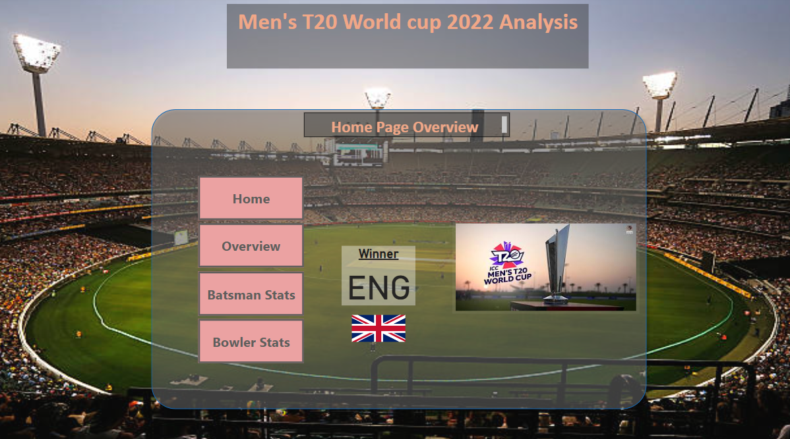
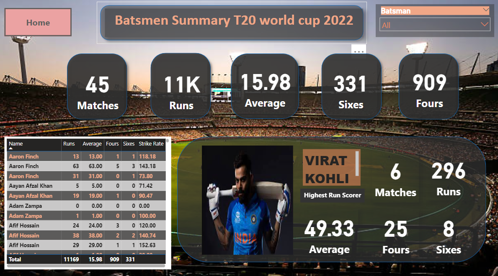
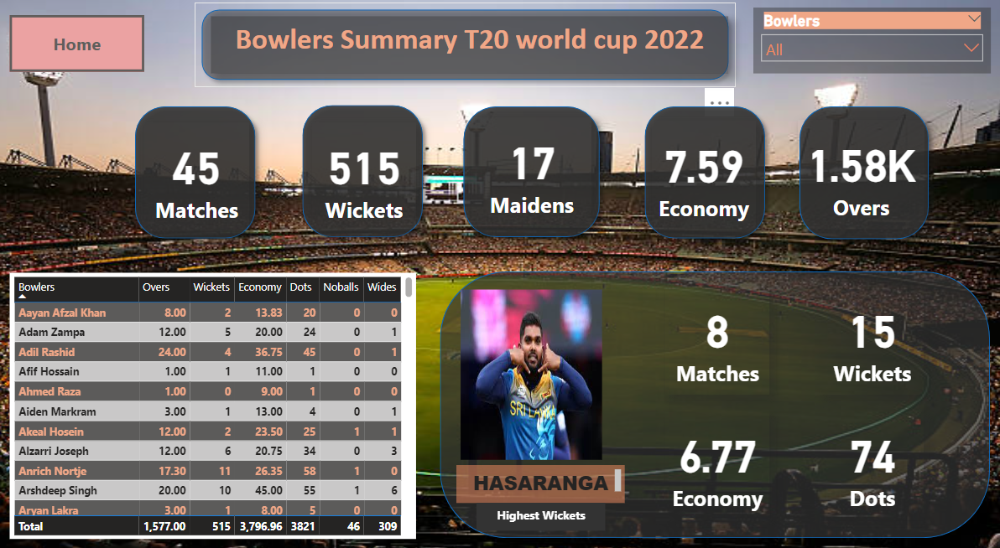

## Visualizing T-20 World Cup Data

### Introduction:

I conducted an Exploratory Data Analysis on the men's 2022 T-20 World Cup. I got data from the official website and did cleaning and transformation. The dashboards contain analysis regarding batting and bowling statistics of the men's T-20 World Cup held in 2022. 

There are 4 dashboards:
Home: Contains the buttons that will help navigate to the other 3 dashboards.
Overview: Gives overall summary, with number of wins based on toss decision and also a table containing all the matches.
Batting: Gives stats related to batting such as total runs, fours, sixes and also contains stats about the highest run scorer.
Bowling: Gives stats about bowling such as wickets, maidens, and economy rate and also has stats of the highest wicket-taker.

I have also uploaded the dataset files in the repository, please feel free to use them.

#### My Insights:

- Team batting first has more wins.

- Virat Kohli was the leading run-scorer.

- Hasaranga was leading wicket taker.

 
 

### Glimpse of my Dashboard:

  

 
 

  

 
 

  
 
 

  
 
 

    
